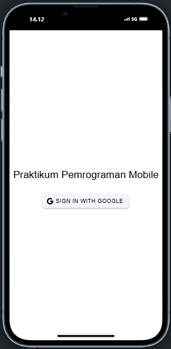
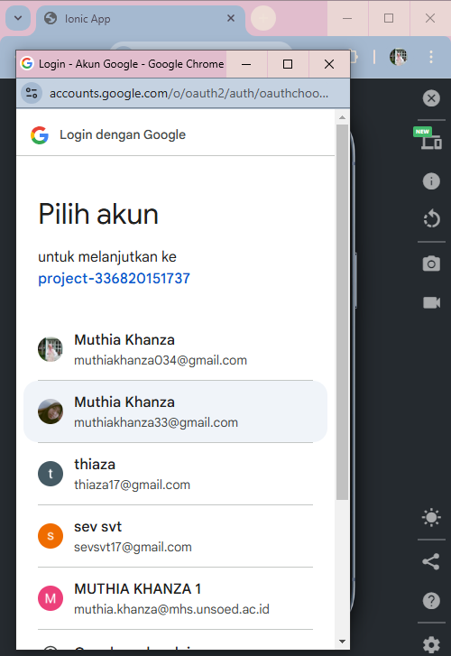
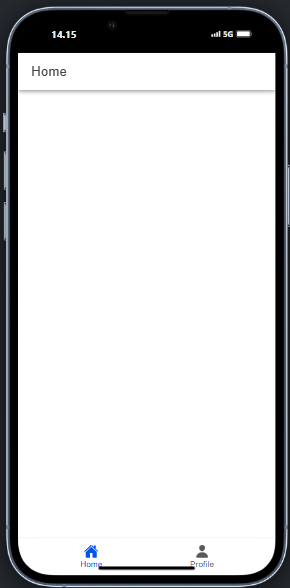
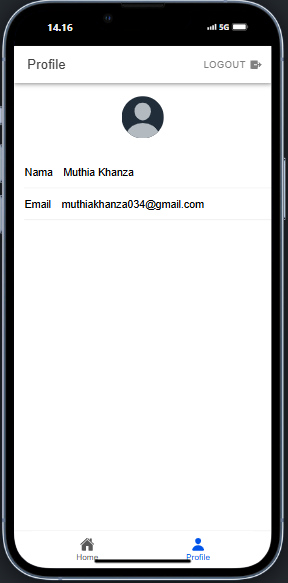

# Praktikum Mobile Pertemuan 9

Nama : Muthia Khanza
NIM : H1D022008
Shift Baru : C
Shift Lama : A

1. **Tampilan Halaman Login**:

Ketika pengguna membuka halaman login, mereka akan melihat tombol "Sign In with Google.". Ketika pengguna menekan tombol login, fungsi `loginWithGoogle` dipanggil. Fungsi ini ada di dalam **store** yang dikelola oleh Pinia. Di dalam fungsi `loginWithGoogle`, aplikasi pertama-tama menginisialisasi **GoogleAuth** dengan konfigurasi seperti `clientId` dan izin akses ke profil dan email pengguna. Selanjutnya aplikasi membuka antarmuka login Google di perangkat pengguna.

2. **Tampilan Halaman Login**:

Ketika pengguna menekan tombol login, fungsi `loginWithGoogle` dipanggil. Fungsi ini ada di dalam **store** yang dikelola oleh Pinia. Di dalam fungsi `loginWithGoogle`, aplikasi pertama-tama menginisialisasi **GoogleAuth** dengan konfigurasi seperti `clientId` dan izin akses ke profil dan email pengguna. Selanjutnya aplikasi membuka antarmuka login Google di perangkat pengguna. Setelah pengguna berhasil login, aplikasi menerima **ID Token** yang mewakili autentikasi pengguna dari Google. Token yang diterima dari Google digunakan untuk membuat kredensial baru dengan **GoogleAuthProvider** dari Firebase. Kredensial ini dikirimkan ke Firebase untuk memvalidasi pengguna dan masuk ke sistem. Setelah berhasil login, Firebase memberikan informasi pengguna (seperti email dan nama) yang kemudian disimpan di variabel `user` dalam **store**.

3. **Tampilan Halaman Home**:

Setelah login sukses, aplikasi mengarahkan pengguna ke halaman home seperti gambar di atas. Jika terjadi kesalahan, aplikasi menampilkan pesan peringatan dengan dialog yang menjelaskan bahwa login gagal.

Pada halaman setelah login, terdapat tampilan dengan tab menu yang ada pada tampilan bawah, menu berupa home dan profile

4. **Tampilan Halaman Profile**:

Ketika pengguna menekan menuprofile maka halaman akan menampilkan tampil seperti gambar di atas. Halaman profil ini menampilkan nama, email, dan foto pengguna yang diambil dari Firebase Authentication. Data pengguna disimpan dalam store `authStore` yang dikelola menggunakan Pinia, dan properti `user` diakses dengan `computed()` untuk mengambil nilai `displayName` dan `email`. Foto profil pengguna diambil dari `photoURL`, dan jika tidak tersedia, gambar default digunakan. Data tersebut kemudian ditampilkan menggunakan komponen Ionic seperti `ion-input` untuk nama dan email, serta `ion-avatar` untuk foto profil. Tombol logout memungkinkan pengguna untuk keluar dari aplikasi dan mengarahkan mereka kembali ke halaman login.
